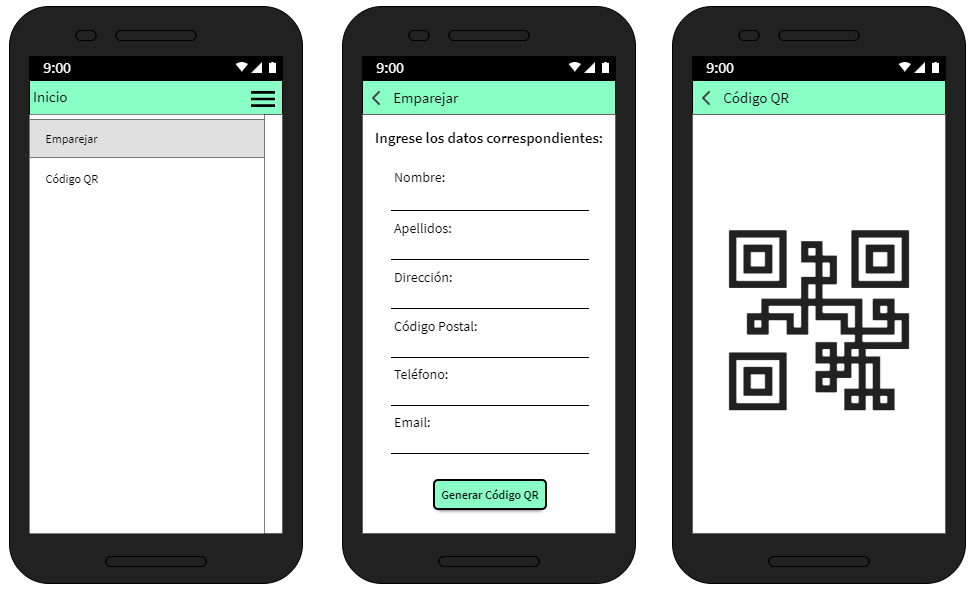
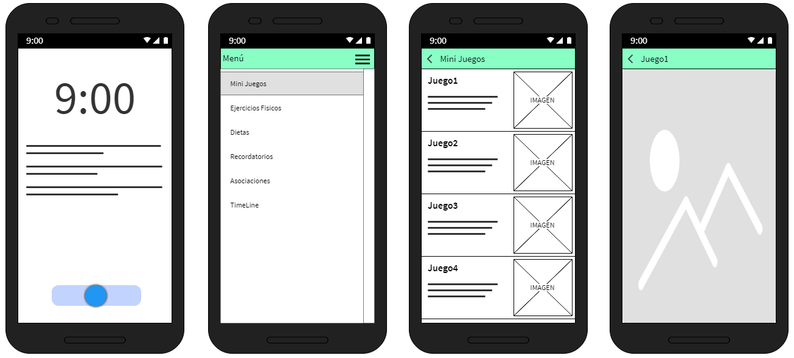
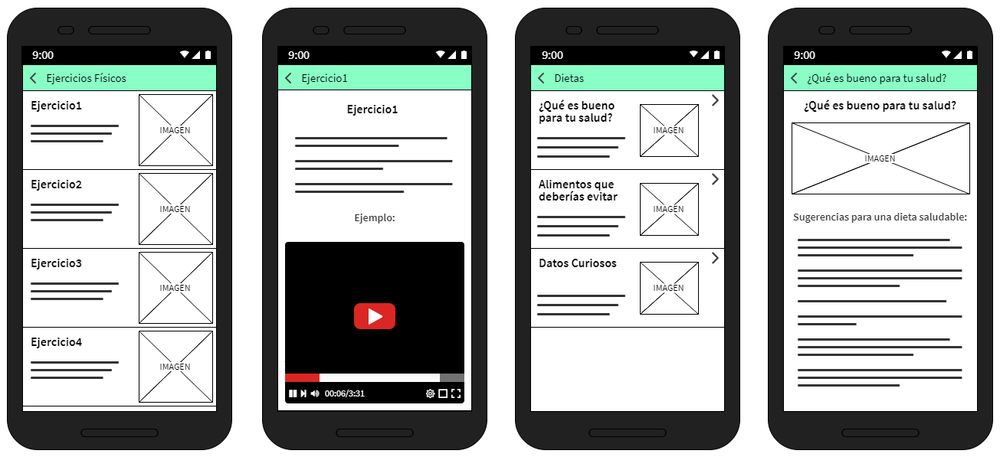
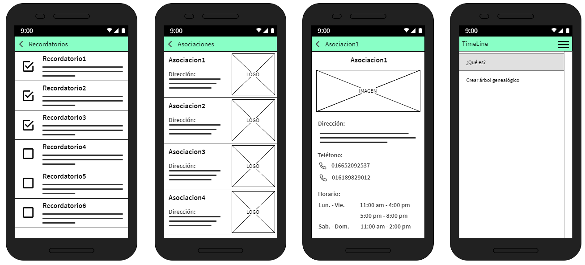
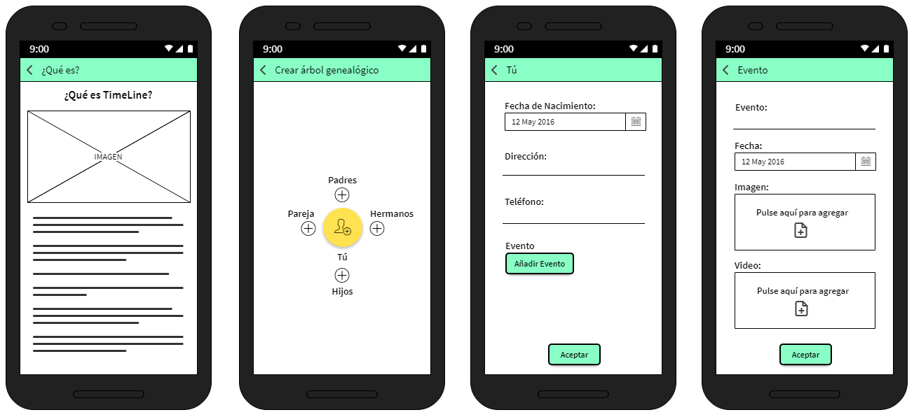

# InteliMind

## **ÍNDICE**

* [1. Intro](README.md#1-intro)
* [2. Qué construí](README.md#2-qué-construí)
* [3. Objetivo del Proyecto](README.md#3-objetivo-del-proyecto)
* [4. Bocetos de la aplicación](README.md#4-bocetos-de-la-aplicacion)

****

## 1. Intro

Las tendencias actuales de la población mexicana hacia la longevidad podrían implicar un gran desafío, ya que esta población tiene mayor incidencia de enfermedades neurodegenerativas, como la demencia. Existen aplicaciones móviles que tienen el objetivo de fortalecer la memoria, pero dado que este tipo de aplicaciones son provenientes de otros países no son conocidas en México y es por ello que realizamos nuestro propio prototipo.

## 2. Qué construí

“InteliMind” es un proyecto orientado al cuidado de la salud de las personas con una enfermedad llamada Alzheimer, incluyendo demencias como lo son el Parkinson. Permite al usuario fortalecer sus habilidades cognitivas con minijuegos que tienen el objetivo de retrasar la constante evolución de la enfermedad, incluyendo además una serie de recomendaciones tanto de ejercicio físico como una dieta alimenticia a seguir ya sea con el mismo objetivo o incluso para prevenir la aparición de la enfermedad. La aplicación también está orientada a aquellas personas encargadas de cuidar a las personas con esta enfermedad, por lo que este usuario tiene secciones exclusivas para el cuidado del paciente.

## 3. Objetivo del Proyecto

* Desarrollar una aplicación móvil con el objetivo de ayudar a adultos mayores que padecen este tipo de demencia, sobre todo a retrasar su pérdida de memoria.
* Programar una aplicación que pueda ser utilizada por la persona con demencia como también la persona encargada de la misma.
* Diseñar y programar un prototipo funcional para mostrar el correcto funcionamiento del mismo.

## 4. Bocetos de la aplicación

***Datos del paciente:***

***Alertas y Selección de juegos:***

***Ejercicios y Dietas:***

***Recordatorios del paciente y Asociaciones:***

***Sección de TimeLine y Recuerdos del paciente:***

